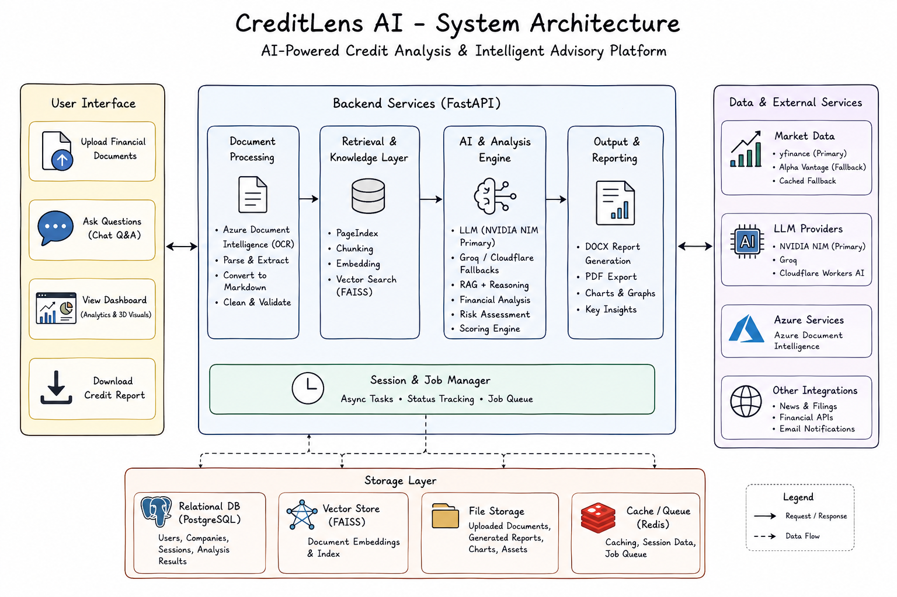

# 🏦 CreditLens AI

> An AI-powered multi-agent credit analysis platform that automates financial document understanding, credit risk assessment, and lending recommendations using Agentic RAG, Azure AI Document Intelligence, and Large Language Models.


---

## 📌 Overview

CreditLens AI streamlines the credit evaluation process by transforming financial statements and supporting documents into structured insights, deterministic credit scores, AI-generated risk assessments, and downloadable analyst reports.

Instead of manually reviewing hundreds of pages, analysts can upload company documents and receive an explainable credit analysis with supporting financial metrics, interactive dashboards, and AI-powered Q&A.

---

## ✨ Key Features

- 📄 Multi-document financial statement upload
- 🤖 AI-powered financial data extraction using Azure Document Intelligence
- 📊 Deterministic credit scoring with explainable breakdown
- 🧠 Multi-Agent RAG pipeline for financial reasoning
- 💬 Context-aware financial Q&A
- 📈 Interactive financial dashboards and visualizations
- 📑 Automated credit proposal generation (DOCX/PDF)
- 📉 Market and stock data integration

---

## 🏗️ System Architecture

<p align="center">

</p>

---

## ⚙️ Workflow

```text
Financial Documents
        │
        ▼
Azure Document Intelligence
        │
        ▼
Structured Financial Extraction
        │
        ▼
Financial Validation
        │
        ▼
Credit Scoring Engine
        │
        ▼
Multi-Agent RAG
        │
        ▼
Risk Assessment & Recommendation
        │
        ▼
Dashboard • Chat • Credit Report
```

---

## 🛠️ Tech Stack

| Category | Technologies |
|-----------|--------------|
| **Frontend** | React, TypeScript, Vite, Tailwind CSS |
| **Backend** | FastAPI, Python |
| **AI Frameworks** | LangChain, LangGraph |
| **LLMs** | NVIDIA NIM, Azure OpenAI |
| **Document AI** | Azure Document Intelligence |
| **Vector Store** | FAISS |
| **Databases** | Neo4j, PostgreSQL |
| **Visualization** | Matplotlib, Three.js |
| **Cloud** | Azure, AWS |

---

## 📂 Project Structure

```text
CreditLens-AI
│
├── backend
│   ├── app
│   ├── requirements.txt
│   └── run.py
│
├── frontend
│   ├── src
│   ├── package.json
│   └── vite.config.ts
│
├── images
│
├── README.md
└── setup.bat
```

---

## 🚀 Getting Started

### Clone the repository

```bash
git clone https://github.com/GauravDin/CreditLens-AI.git
cd CreditLens-AI
```

### Backend

```bash
cd backend

python -m venv .venv

# Windows
.venv\Scripts\activate

pip install -r requirements.txt

uvicorn app.main:app --reload
```

### Frontend

```bash
cd frontend

npm install

npm run dev
```

---

## 📊 Core Modules

- Financial Document Processing
- Credit Risk Analysis
- AI-powered Financial Q&A
- Credit Proposal Generator
- Market Intelligence
- Interactive Dashboard

---

## 🎯 Future Improvements

- Multi-bank lending policies
- Real-time financial monitoring
- Portfolio risk analytics
- OCR support for scanned financial statements
- Cloud deployment with Kubernetes

